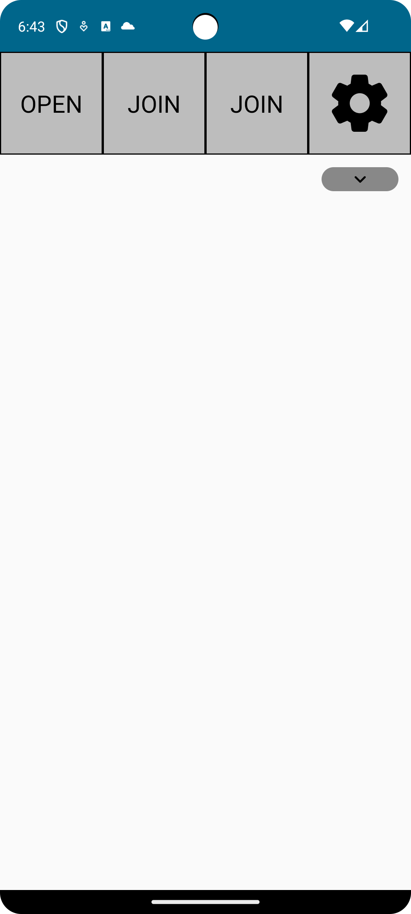

# RPGHero

RPGHero is an Android app created to manage your RPG games. It's developed for the computer science course "[Informatique mobile](https://programmes.uqac.ca/8INF257)" at [Université du Québec à Chicoutimi (UQAC)](https://uqac.ca/).

## Running this app

This project is designed to run using Android Studio and Gradle. Simply use the "Run app".

### License

This project is [MIT licensed](./LICENSE).